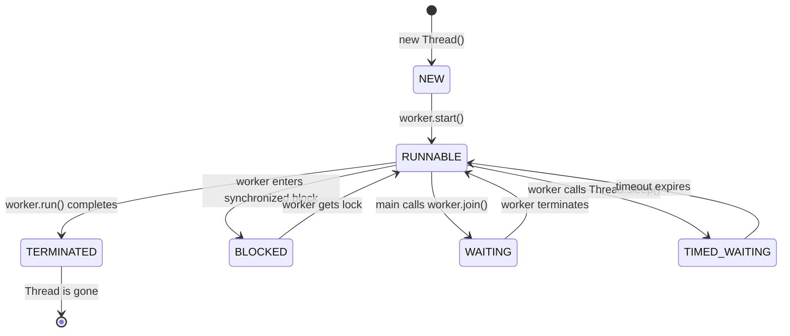

# 2. Thread Lifecycle Deep Dive 🧬

Prati Java program `main` ane oka thread tho start avtundi. Manam, aa `main` thread lo undi, kotha worker threads ni create chestam. Ala create chesina worker thread, puttina daggara nunchi chanipoye varaku, adi chala different states (dashalu) lo untundi. Manam, `main` thread nunchi, ee states ni observe cheyochu. Ee states ni ardham chesukovadam, debugging lo chala critical.

Java lo, `Thread.State` enum lo define chesinattu, oka worker thread 6 states lo undochu.

### 1. NEW 👶
Manam `main` thread lo `Thread worker = new Thread();` ani call chesinappudu, aa `worker` thread object ee `NEW` state lo untundi. Ee stage lo, worker inka pani start cheyaledu. OS daggara inka ee thread ki sambandinchina resources emi allocate avvaledu. Idi కేవలం oka Java object.

### 2. RUNNABLE 🏃‍♂️
Manam `main` thread nunchi `worker.start()` ani pilavagane, aa worker thread `RUNNABLE` state loki vastundi. Kani, `RUNNABLE` ante, adi ventane CPU meeda run avtundi ani ardham kaadu.
*   **Ready:** Worker thread pani cheyadaniki ready ga undi, kani OS thread scheduler inka deeniki **CPU Core** time ivvaledu.
*   **Running:** The OS scheduler has picked our worker thread, and it is currently executing its `run()` method on a CPU core.

### 3. BLOCKED 🚧
Oka worker thread, vere thread (or `main` thread) hold chesina oka **monitor lock** (ante, oka `synchronized` block) kosam wait chestu unte, adi `BLOCKED` state loki veltundi.
**Hardware Connection:** When a thread becomes blocked, the OS performs a **Context Switch** to run another thread. The blocked thread's state is saved, and it no longer consumes CPU cycles until the lock is released.

### 4. WAITING 🧘
Mana `main` thread, worker thread chese oka specific action kosam ananthamga (indefinitely) wait cheyali anukunte, worker thread `WAITING` state loki veltundi.
*   **Example:** `main` thread, `worker.join()` ani call cheste, `main` thread `WAITING` state loki veltundi, worker thread tana pani poorthi chese varaku. (Note: The diagram shows the worker thread waiting, but `join` makes the *calling* thread wait).
*   A worker thread can enter the `WAITING` state if it calls `Object.wait()`. Ee state lo unna thread, vere thread `notify()` chese varaku `RUNNABLE` state ki tirigi radu.

### 5. TIMED_WAITING ⏰
Idi `WAITING` state lantiదే, kani oka time limit tho. Worker thread `Thread.sleep(2000)` ani call cheste, adi 2 seconds varaku `TIMED_WAITING` state lo untundi.

### 6. TERMINATED ⚰️
Worker thread tana `run()` method ni poorthi chesaka, adi `TERMINATED` state loki veltundi. Ee state lo unna thread ni manam malli start cheyalem.

### Thread Scheduling: JVM vs. OS
*   **JVM:** Creates and manages the `Thread` objects and their states.
*   **OS (Operating System):** The OS scheduler decides which `RUNNABLE` thread gets to run on which **CPU core**.

---

Ippudu manam `main` thread nunchi chuste, oka worker thread jeevitham ela untundo ardham chesukunnam. Mari, asalu ee worker thread ni create cheyadam ela? How do we, from the `main` thread, give a task to a new thread? Let's find out! 💻