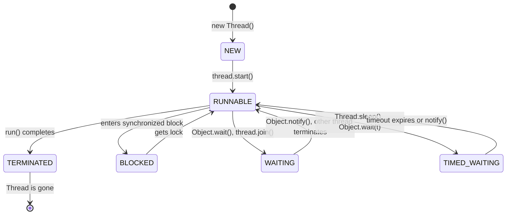

# 2. Thread Lifecycle Deep Dive 🧬

Oka thread create ayinappati nunchi, adi tana pani poorthi chesi chanipoye varaku, adi chala different states (dashalu) lo untundi. Ee states ni ardham chesukovadam, debugging and performance tuning lo chala critical. Manam mundu section lo Thread ante ento chusam, ippudu daani jeevitha chakram (lifecycle) gurinchi chuddam.

Java lo, `Thread.State` enum lo define chesinattu, oka thread 6 states lo undochu.

### 1. NEW 👶
Oka thread object ni manam create chesinappudu, adi ee `NEW` state lo untundi.
`Thread myThread = new Thread();`
Ee stage lo, thread inka start avvaledu. OS daggara inka ee thread ki sambandinchina resources emi allocate avvaledu. Idi కేవలం oka Java object.

### 2. RUNNABLE 🏃‍♂️
Ee state konchem tricky. Manam `myThread.start()` ani pilavagane, thread `RUNNABLE` state loki vastundi. Kani, `RUNNABLE` ante, adi ippudu CPU meeda run avtundi ani ardham kaadu.

`RUNNABLE` state lo rendu sub-states unnayi:
*   **Ready:** Thread run avvadaniki ready ga undi, kani OS thread scheduler inka deeniki **CPU Core** time ivvaledu. Idi OS scheduler yokka ready queue lo waiting.
*   **Running:** The OS scheduler has picked this thread, and it is currently executing instructions on a CPU core.

Java lo ee rendu sub-states ni kalipi `RUNNABLE` ane antaru.

### 3. BLOCKED 🚧
Oka thread, vere thread hold chesina oka **monitor lock** (ante, oka `synchronized` block or method) kosam wait chestu unte, adi `BLOCKED` state loki veltundi.

**Hardware Connection:** When a thread becomes blocked, the OS performs a **Context Switch** to run another thread. The blocked thread's state is saved, and it no longer consumes CPU cycles until the lock is released.

### 4. WAITING 🧘
Oka thread, vere thread chese oka specific action kosam ananthamga (indefinitely) wait chestu unte, adi `WAITING` state lo untundi. Ee state lo unna thread, CPU resources ni consume cheyadu.

Ee state loki velladaniki konni karanalu:
*   Vere thread meeda `thread.join()` call chesinappudu.
*   Oka object meeda `Object.wait()` call chesinappudu.
*   `LockSupport.park()` lanti methods call chesinappudu.

`BLOCKED` state laage, `WAITING` state lo unna thread kuda CPU ni use cheyadu. The OS will context-switch it out. The key difference is that a `BLOCKED` thread is waiting for a lock, while a `WAITING` thread is waiting for a signal from another thread.

### 5. TIMED_WAITING ⏰
Idi `WAITING` state lantiదే, kani oka time limit tho. Oka thread, vere thread chese action kosam, or kontha samayam varaku wait chestu unte, adi `TIMED_WAITING` state lo untundi.
`Thread.sleep(long millis)` or `Object.wait(long timeout)` lanti calls valla ee state loki veltundi.

### 6. TERMINATED ⚰️
Oka thread tana `run()` method ni poorthi chesaka, or an exception valla abnormal ga exit ayinaka, adi `TERMINATED` state loki veltundi. Ee state lo unna thread ni malli start cheyalem. Idi thread yokka jeevitha chakram lo chivari dasha.

### Thread Scheduling: JVM vs. OS
*   **JVM:** The Java Virtual Machine is responsible for creating and managing the `Thread` objects and their states as defined by the Java Language Specification.
*   **OS (Operating System):** The actual scheduling—deciding which `RUNNABLE` thread gets to run on which **CPU core** and for how long—is the job of the OS scheduler. Manam `Thread.setPriority()` lanti methods use chesi OS ki oka hint ivvachu, kani final decision OS de.

---

Ippudu manam thread yokka jeevitha chakram gurinchi nerchukunnam. So, a thread is born, it becomes runnable... kani asalu daaniki pani ela ivvali? How do we tell a thread what to do? Next, manam Java lo threads ni ela create cheyalo, a different approaches ento chuddam. Let's get practical! 💻