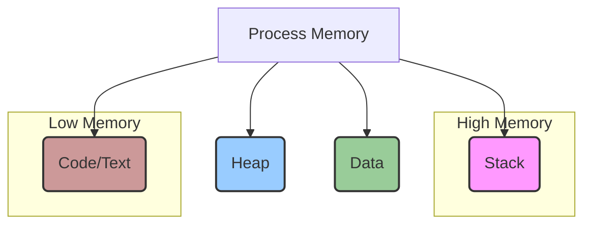
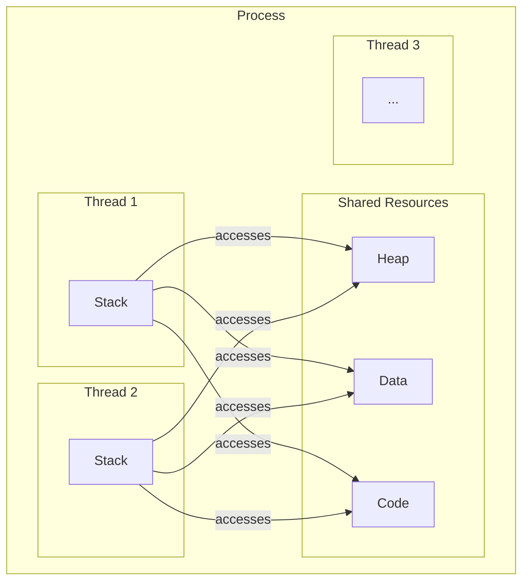

# 🚀 Phase 1: Core Concepts - Process vs Thread vs Coroutine

Hi friends! 👋 Multithreading ane ee beautiful world loki welcome. Meeru eppudaina anukunnara, "Okate sari computer inni panulu ela chestundi? Nenu music vintu, code rastu, background lo files download chestunte... anni smooth ga ela jarugutunnayi?" 🤔

Ee magic venakala unna core concepts ni manam ippudu telusukundam. Let's start with the basics: Process, Thread, and Coroutine.

## Analogy: The Grand Restaurant 🍽️

Imagine chesukondi, meeru oka pedda restaurant ki vellaru.

-   **Restaurant (The Process)**: Ee mottham restaurant ni oka **Process** anukondi. Daani kitchen, staff, tables, menu, anni kalipi oka unit. Daaniki sontanga resources (kitchen equipment, ingredients) untayi. Vere restaurant (vere process) direct ga ee kitchen ni vadukoledu. Each process is isolated.

-   **Chefs (The Threads)**: Aa restaurant kitchen lo undey okko chef ni oka **Thread** anukondi. Vallandaru kalisi aa restaurant (process) ki unna resources ni (stove, ingredients, pans) share chesukuntaru. Okate kitchen lo, multiple chefs (threads) different tasks (cutting vegetables, cooking curry, making rotis) chestunnaru. Ee chefs andaru okari panilo okaru help chesukuntu, order ni tvaraga complete chestaru. Idhe multithreading!

-   **Chef's Focus (The Coroutine)**: Ippudu, oka chef unnadu. Atanu soup prepare chestunnadu. Soup maragadaniki time padutundi. Aa waiting time lo, atanu veroka pani (vegetables cut cheyadam lanti) start chesi, malli soup daggaraki vastadu. Ee task switching (soup -> cutting -> soup) ni atane manage chesukuntadu, kitchen manager (OS) cheppakarledu. Idhe **Coroutine**. Chala lightweight task switching.

---

## Process (ప్రక్రియ) ante enti?

Computer lo run ayye ప్రతీ program (like Chrome, VS Code, Spotify) ni oka **Process** antaru. Idi oka container lantidi. Daaniki sontanga memory space, system resources (file handles, network sockets) untayi.

-   **Isolation**: Oka process memory loki inkoka process direct ga choodaledu. Idhi security ki chala important. Chrome crash aythe, mee VS Code crash avvadu, endukante avi veru veru processes.
-   **Heavyweight**: Process create cheyadam anedi konchem costly affair (time and memory açısından). Endukante daaniki separate memory space allocate cheyali.

### Memory Layout of a Process

Prati process ki OS (Operating System) konni memory segments istundi:

-   **Stack**: Local variables, function call information store chestundi.
-   **Heap**: Dynamic memory allocation (Java lo `new` keyword tho create chese objects anni ikkade untayi).
-   **Data**: Global and static variables.
-   **Code/Text**: Asal program instructions (compiled code).

---

## Thread (థ్రెడ్) ante enti?

Thread anedi process lo oka chinna part. "A thread is a lightweight process". Oka process lo multiple threads undochu, and avi anni aa process yokka memory ni (Heap, Data, Code) share chesukuntayi.

-   **Shared Memory**: Ikkade asalu magic undi ✨. Threads anni okate Heap, Data, and Code segment ni share chesukuntayi. Anduke vaati madhya communication chala easy and fast ga untundi.
-   **Own Stack**: Kaani, prati thread ki daani sonta **Stack** untundi. Endukante, okko thread veru veru functions ni execute chestu undochu, so vaati local variables and call history separate ga undali.
-   **Lightweight**: Process tho polisthe, thread create cheyadam chala cheap (less time, less memory).

### Memory View: Process vs Threads

---

## Coroutine (కోరొటీన్) ante enti?

Coroutines ni "user-level threads" or "fibers" ani kuda antaru. Ivanni inka lightweight.

-   **Cooperative Multitasking**: Threads ni OS schedule chestundi (preemptive multitasking). Kaani coroutines vaati execution ni ave control chesukuntayi (cooperative). Oka coroutine tanaki panem ledu anukunnappudu, స్वेच्छाగా (voluntarily) control ni inkoka coroutine ki istundi.
-   **Application-Level**: OS ki coroutines gurinchi em teliyadu. Antha application level (or programming language level) lo manage cheyabadutundi. Java lo Project Loom (Virtual Threads) vachaka, idi chala popular ayyindi. Manam deeni gurinchi **Expert Level** section lo chala deep ga matladukuntam.

---

## Context Switching: The Real Cost 💰

"Context Switching" ante, CPU ni oka task (process/thread) nunchi inkoka task ki marchadam.

-   **Process Context Switch**: Idi chala costly. Endukante, OS current process yokka state (registers, memory maps, etc.) antha save chesi, kottha process yokka state ni load cheyali. TLB (Translation Lookaside Buffer) flush avuthundi, idi memory access ni slow down chestundi. Restaurant analogy lo, kitchen antha clean chesi, kottha restaurant setup chesinattu. Chala pani! 🥵
-   **Thread Context Switch**: Idi chala cheaper. Endukante threads anni okate memory space (address space) ni share chesukuntayi. OS just thread-specific data (stack pointer, registers) ni marchali. Memory maps marchalsina avasaram ledu. Kitchen lo, oka chef pani aapi, inkoka chef vachi ade stove meeda pani start chesinattu. Chala fast! 😎

---

### 📖 Technical Deep Dive

| Feature             | Process                               | Thread                                  | Coroutine (Virtual Thread)                |
| ------------------- | ------------------------------------- | --------------------------------------- | ----------------------------------------- |
| **Analogy**         | Separate Restaurant                   | Chefs in the same Kitchen               | Chef multi-tasking while waiting          |
| **Memory**          | Isolated Memory Space                 | Shared Memory (Heap, Data)              | Shared Memory                             |
| **Creation Cost**   | High                                  | Low                                     | Very Low                                  |
| **Context Switch**  | High (OS involvement)                 | Low (OS involvement)                    | Very Low (No OS involvement)              |
| **Scheduling**      | Preemptive (by OS)                    | Preemptive (by OS)                      | Cooperative (by application/JVM)          |
| **Communication**   | Slow (via IPC like pipes, sockets)    | Fast (via shared memory)                | Very Fast (within the same thread)        |
| **Example**         | Running Chrome & VS Code separately   | Multiple tabs in Chrome                 | Asynchronous tasks in a web server        |

---

## What's Next? 🤔

Manam ippudu process ante ento, thread ante ento clear ga telusukunnam. Oka process lo unde ee "chefs" (threads) ki kuda oka life untundi. Avi putadathayi, pani chestayi, aagutayi, and finally chanipotayi.

Ee "Thread Lifecycle" gurinchi telusukokapothe, manam vaatini effective ga manage cheyalem. Enduku oka thread `BLOCKED` state lo undi? `WAITING` ki `BLOCKED` ki teda enti? Ee prashnalaki samadhanam telistene, manam complex concurrent applications ni debug cheyagalam.

Ready to uncover the secrets of a thread's life? 🕵️‍♂️ Let's dive into the **Thread Lifecycle** in our next chapter! 👉

[➡️ Next: 02-thread-lifecycle-deep-dive.md](./02-thread-lifecycle-deep-dive.md)