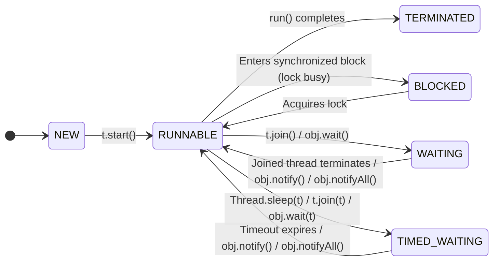

# 🚀 Phase 1: Thread Lifecycle Deep Dive - A Thread's Journey

[⬅️ Prev: 01-process-vs-thread.md](./01-process-vs-thread.md)

Manam mundu chapter lo manchiga restaurant analogy tho "chefs" (threads) ante ento ardham chesukunnam. Super! Ippudu aa chef yokka day-in-the-life chuddam.
Ante, atanu kitchen (process) loki enter ayinappudu nunchi, tana shift complete ayye varaku em chestadu? Atanu eppudu pani chestadu? Eeppudu rest teeskuntadu? Eeppudu vere valla kosam wait chestadu? 🤔

"Asalu idi naku enduku anukuntunnara?" Ee states gurinchi teliyakapothe, manam complex problems ni debug cheyalem. Mee application enduku slow ga undi, leda enduku hang aypoyindi ani adiginappudu, "Oh, maybe andulo unna threads anni `BLOCKED` or `WAITING` state lo unnayi emo" ani cheppagalige level ki manam ravali. Anduke ee topic antha important.

Let's explore the fascinating journey of a thread!

## Analogy: The New Employee's Journey 🧑‍💼

Oka kottha employee (thread) company (process) lo join ayinప్పటి నుండి, valla day-to-day work ni thread lifecycle tho compare cheddam.

1.  **NEW (Offer Letter Received)**: Oka candidate ni select chesaru, offer letter kuda icharu. But atanu inka company lo join avvaledu. Just कागితం మీద (on paper) atanu oka employee.
    -   *In Java*: `Thread t = new Thread();` ani anagane, oka thread object create avuthundi. Adi **NEW** state lo untundi. Inka life start avvaledu.

2.  **RUNNABLE (First Day at Office)**: Employee ee roju office lo join ayyadu. Atanu ippudu pani cheyadaniki ready. Atanu actual ga work chestu undochu, leda manager (OS Scheduler) eppudu pani assign chestada ani tana desk daggara wait chestu undochu. Ee rendu situations ni kalipi **RUNNABLE** antam.
    -   *In Java*: `t.start()` call cheyagane, thread **RUNNABLE** state loki velthundi. JVM ee thread ni Thread Scheduler ki istundi. Scheduler deeni execution ni start chestundi.

3.  **BLOCKED (Meeting Room Locked)**: Employee ki oka important meeting undi, kaani meeting room ni vere team use chestundi. Room bayata lock vesi undi. Aa team vellipoyi, lock teese varaku ee employee em cheyalekha, akkade **BLOCKED** ayipoyadu.
    -   *In Java*: Oka thread `synchronized` block loki enter avvadaniki try chesinappudu, aa lock already inkoka thread daggara unte, ee thread **BLOCKED** state loki velthundi.

4.  **WAITING (Waiting for a Colleague)**: Manager ee employee tho cheppadu, "Meeru design cheyalante, Team-B valla analysis report ravali. Adi vachhe varaku wait cheyandi" ani. Ikkada employee resource kosam block avvaledu, but esplicit ga wait cheyamani chepparu. So atanu **WAITING** state lo unnadu.
    -   *In Java*: `object.wait()` or `thread.join()` call chesinappudu, thread **WAITING** state loki velthundi. Vere thread `notify()` or `notifyAll()` call chese varaku or join ayina thread terminate ayye varaku wait chestune untundi.

5.  **TIMED_WAITING (Waiting with a Deadline)**: Manager malli cheppadu, "Report kosam 5 PM varaku wait cheyandi. Appatiki rakapothe, naku oka mail petti meeru intiki vellipondi". Ikkada kuda waiting ee, kaani oka time limit tho.
    -   *In Java*: `Thread.sleep(5000)`, `object.wait(2000)`, `thread.join(1000)` lanti methods call cheste, thread **TIMED_WAITING** state loki velthundi. Time aypogane or `notify()` call vastene, adi malli `RUNNABLE` avuthundi.

6.  **TERMINATED (End of Work Day)**: Employee ki ichina tasks anni complete ayipoyayi. Tana shift aypoyindi. Atanu system shutdown chesi intiki vellipoyadu. His journey is over.
    -   *In Java*: Thread yokka `run()` method execution complete ayipogane, adi **TERMINATED** state loki velthundi. Malla deenini start cheyalem.

---

## Thread State Transitions Diagram 📈

Ee states anni okati nunchi inkokadaniki ela marutayo ee diagram lo choodandi.

---

### 📖 Technical Deep Dive

| State           | Description                                                                                             | How to get here?                                                               | How to leave?                                                               |
| --------------- | ------------------------------------------------------------------------------------------------------- | ------------------------------------------------------------------------------ | --------------------------------------------------------------------------- |
| **NEW**         | Thread object create chesam, kani inka `start()` call cheyaledu.                                         | `Thread t = new Thread();`                                                     | `t.start()` call cheyagane `RUNNABLE` loki velthundi.                         |
| **RUNNABLE**    | Thread execution ki ready ga undi, scheduler kosam wait chestundi or already execute avuthundi.           | `t.start()`                                                                    | `run()` method complete aythe `TERMINATED`, leda scheduler vere state ki pampochu. |
| **BLOCKED**     | Monitor lock kosam wait chestundi.                                                                      | `synchronized` block/method loki enter avvadaniki try cheste (lock held by others). | Vere thread lock release cheyagane.                                         |
| **WAITING**     | Vere thread oka specific action chese varaku indefinitely wait chestundi.                                 | `Object.wait()`, `Thread.join()`, `LockSupport.park()`                         | `Object.notify()`, `Object.notifyAll()`, joined thread terminates.          |
| **TIMED_WAITING** | Kontha time varaku wait chestundi.                                                                      | `Thread.sleep(ms)`, `Object.wait(ms)`, `Thread.join(ms)`                        | Time expire ayina, leda `notify()` / `notifyAll()` call vachina.            |
| **TERMINATED**  | `run()` method execution antha complete aypoyindi. Thread pani mugisindi.                               | `run()` method returns normally or throws an exception.                        | Ee state nunchi bayataki raledu. Thread is dead. 💀                           |

---

## What's Next? 🤔

Okay, ippudu manaki thread life lo enni stages untayo, avi okati nunchi inkokadaniki ela velthayo a theoretical understanding vachindi. We can now talk like a pro about why a thread is stuck! 😎

Kaani... asalu ee "threads" ni create cheyadam ela? Mana "chefs" ni kitchen loki aahvaninchadam ela? `Thread` class ni extend cheyala? `Runnable` interface ni implement cheyala? Renditiki teda enti? Deni valla ekkuva advantages unnayi? Inka modern Java lo vacche Lambda expressions tho inka easy ga thread ni create cheyoccha?

Theory chalu, let's get our hands dirty! 💻 Mana next chapter lo, maname sontanga threads ni create chesi, vaatini life loki teeskuni vaddham.

Ready to write some real code? Let's go! 👇

[➡️ Next: 03-creating-threads.md](./03-creating-threads.md)